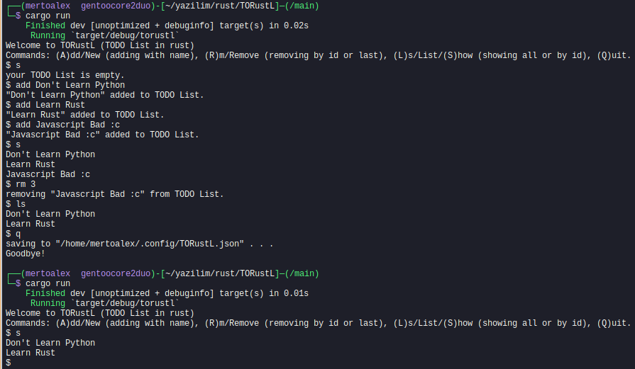

# TORustL
TODO List editor (TUI) with rusty codes.

## to compile
```bash
cargo build
```

## to run
```bash
sudo cp target/debug/torustl #or replace "sudo" with "doas"
```

### a screenshot:



### files:
~/.config/TORustL.json - saves TODO List to here.
